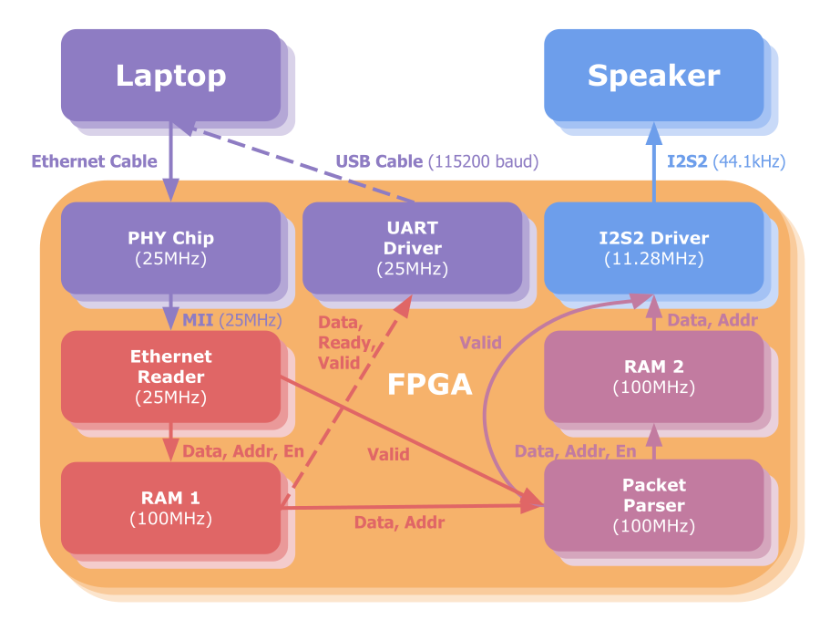

# UDP FPGA

Implementing raw ethernet frame parsing in hardware to communicate using a point-to-point ethernet link connection using the UDP data protocol.

https://github.com/daniel-sudz/udp-fpga/assets/52898838/3c39b399-b354-42f4-a91c-baba29a6c7b9

# Networking Overview

<p align="center">
   
 </p>

The OSI networking model provides a conceptual understanding of how applications can communicate across networked protocols. For our project the correspondance is as follows: 

* Layer 1 corresponds to the PHY or the Ethernet Physical Layer. The PHY is onboard the FPGA and is reponsible for converting the analog data across CAT5/CAT6 cables into a digital signal that can be further processed.
* Layer 2 corresponds to the layer 2 ethernet frame as described below.
* Layer 3 correspods to the IPV4 protocol as described below.
* Layer 4 correponds to the UDP protocol as described below.

### Ethernet Header Frame

| **MAC Destination** | **MAC Source** | **Ethertype** | **Payload** | **Frame Check Sequences** |
| ------------------------- | -------------------- | ------------------- | ----------------- | ------------------------------- |
| 6 bytes                   | 6 bytes              | 2 bytes             | variable          | 4 bytes                         |

A layer two ethernet frame is laid out as follows above. The payload of the ethernet frame contains the next level of the networking stack. In our case, we set the "ethertype" type field to `0x0800` which specifies that the payload will contain an IPV4 packet.

The ethernet protocol is a global delivery mechanism. Packets are routed from a source MAC adress to a destination MAC address. Every device comes with a unique MAC adress from the factory that be universally identified.

### IPV4 Header Frame

| Octet, Bits | 0                             | 1   | 2   | 3   | 4        | 5   | 6   | 7   | 8                  | 9   | 10  | 11  | 12  | 13  | 14            | 15  | 16                 | 17  | 18  | 19             | 20  | 21  | 22  | 23  | 24  | 25  | 26  | 27  | 28  | 29  | 30  | 31  |
| ----------- | ----------------------------- | --- | --- | --- | -------- | --- | --- | --- | ------------------ | --- | --- | --- | --- | --- | ------------- | --- | ------------------ | --- | --- | -------------- | --- | --- | --- | --- | --- | --- | --- | --- | --- | --- | --- | --- |
| 0           | **VERSION**             | ... | ... | ... | **IHL** | ... | ... | ... | **DSCP**     | ... | ... | ... | ... | ... | **ECN** | ... | **LEN**      | ... | ... | ...            | ... | ... | ... | ... | ... | ... | ... | ... | ... | ... | ... | ... |
| 4           | **ID**                  | ... | ... | ... | ...      | ... | ... | ... | ...                | ... | ... | ... | ... | ... | ...           | ... | **FLAGS**    | ... | ... | **FRAG** | ... | ... | ... | ... | ... | ... | ... | ... | ... | ... | ... | ... |
| 8           | **TTL**                 | ... | ... | ... | ...      | ... | ... | ... | **PROTOCOL** | ... | ... | ... | ... | ... | ...           | ... | **CHECKSUM** | ... | ... | ...            | ... | ... | ... | ... | ... | ... | ... | ... | ... | ... | ... | ... |
| 12          | **SRC** **ADDR**  | ... | ... | ... | ...      | ... | ... | ... | ...                | ... | ... | ... | ... | ... | ...           | ... | ...                | ... | ... | ...            | ... | ... | ... | ... | ... | ... | ... | ... | ... | ... | ... | ... |
| 16          | **DEST** **ADDR** | ... | ... | ... | ...      | ... | ... | ... | ...                | ... | ... | ... | ... | ... | ...           | ... | ...                | ... | ... | ...            | ... | ... | ... | ... | ... | ... | ... | ... | ... | ... | ... | ... |
| 20          | **OPTIONS (IHL>5)**          | ... | ... | ... | ...      | ... | ... | ... | ...                | ... | ... | ... | ... | ... | ...           | ... | ...                | ... | ... | ...            | ... | ... | ... | ... | ... | ... | ... | ... | ... | ... | ... | ... |
| ...         | ...                           | ... | ... | ... | ...      | ... | ... | ... | ...                | ... | ... | ... | ... | ... | ...           | ... | ...                | ... | ... | ...            | ... | ... | ... | ... | ... | ... | ... | ... | ... | ... | ... | ... |
| 56          | ...                           | ... | ... | ... | ...      | ... | ... | ... | ...                | ... | ... | ... | ... | ... | ...           | ... | ...                | ... | ... | ...            | ... | ... | ... | ... | ... | ... | ... | ... | ... | ... | ... | ... |

The IPV4 protocol extends the global delivery mechanism of point-to-point ethernet by enabling delivery of packets to specific IP addresses. Depending on the IP range, a given IP address may be either local or global to a given network. As a result, IP ranges provide a level of hierarchy that allows the delivery of packets to scale effectively to a large number of inter-connected networks.

### UDP Header Frame

| Source Port | Destination Port | Length  | Checksum | Data     |
| ----------- | ---------------- | ------- | -------- | -------- |
| 2 bytes     | 2 bytes          | 2 bytes | 2 bytes  | variable |


The UDP protocol is the simplest method of sending and recieving raw data packets within an IPV4 frame. The protocol is "one-shot" in that it provides no redudency for packets that have failed to deliver. The UDP protocol is commonly used in streaming application where only the latest packet is of importance to the user. The UDP protocol provides segmentation of data streams with the source and destination port fields enabling up to 65536 unique concurrent data streams between any two given IP addresses. 

# System Overview 
<p align="center">
   
 </p>

# Software

The software allows chunking a 44.1Khz `.wav` and streams it over UDP ethernet packets to be parsed by the FPGA. The software documentation can be found at https://github.com/daniel-sudz/udp-fpga/tree/main/software.

# Networking Link Layer Linux Resources

- [ ] Calculate IP Checksum: https://gist.github.com/david-hoze/0c7021434796997a4ca42d7731a7073a
- [ ] Send Raw Ethernet Packet in Linux: https://gist.github.com/austinmarton/1922600
- [ ] Recieve Raw Ethernet Packet in Linux: https://gist.github.com/austinmarton/2862515


# Setting up our project
To get started, clone our repository.
```bash
git clone git@github.com:daniel-sudz/udp-fpga.git
```
If you already had it cloned for some reason, make sure that it is up to date by running a `git pull`, this ensures you have any changes from random bug fixes we may have had to implement.

This project assumes you have the FPGA development tools we have been using throughout the Advanced CompArch course. If you don’t have them installed, you can follow the below steps, otherwise skip to the “Programming the FPGA” section.

## Open Source Software and Miscellaneous Tools
Follow the instructions on the official [guide](https://www.opensourceagenda.com/projects/oss-cad-suite-build#Installation).

  * [ ] Download the appropriate archive from the releases page. You probably want `linux-x64`, ask for help if you are running on macOS on an M processor and not virtualizing.
  * [ ] Create a directory without spaces and move the file there. The code below assumes its stored in a directory called `embedded` at the root of your home folder.

  ```bash
  mkdir -p ~/embedded/
  # Your date code will be very different!
  mv ~/Downloads/oss-cad-suite-linux-x64-20230907.tgz ~/embedded
  cd ~/embedded
  tar -xvzf oss-cad-suite-linux-x64-20230907.tgz 
  rm oss-cad-suite-linux-x64-20230907.tgz 
  ```

Install the following miscellaneous tools as well:
```bash
# Build Tools
sudo apt-get update
sudo apt-get upgrade
# libtinfo5 and libxtst6 are for vivado, the rest are just good system level things to have.
sudo apt-get install build-essential nano python3 libusb-1.0.0 git libtinfo5 libxtst6
# Note, we are going to double install this so we have it available even without the OSS tools.
sudo apt-get install python3-bitstring
```

## Vivado install
The web installer is better than ever, so that is now the supported method of installing tools. Make sure you have at least 100GB of free space, and can leave your computer connected to the internet for a while. 

Checklist:
  * [ ] Create an account on [amd.com](amd.com). You will need to click the little avatar icon on the top and then select Create Account.
  * [ ] Download the Linux 2023.2 version of the "Unified Installer" from [here](https://www.xilinx.com/support/download.html)
  * [ ] Create a directory for your install.
    ```mkdir -p ~/embedded/xilinx```
  * [ ] Run the installer:

  ```bash
    cd ~/Downloads
    # makes the file executable, tab complete instead of copy and past as version will change
    chmod +x FPGAs_AdaptiveSoCs_Unified_2023.2_1013_2256_Lin64.bin
    ./FPGAs_AdaptiveSoCs_Unified_2023.2_1013_2256_Lin64.bin
  ```

Follow these steps once you are in the installer:
- Log in using the account you created earlier.
- Select Download and Install Now. Click Next.
- Select Vitis, click Next.
- Uncheck Vitis IP Cache, Vitis Networking P4, "Install devices for Alveo...", "Install Devices for Kria...", "Ultrascale", "UlstraScale+", "Versal ACAP", "Engineering Sample Devices...". 
- Select the desired install path, perhaps where you made the embedded folder before.

## Programming the FPGA
Change into our repository if you haven't already.

```bash
cd udp-fpga
```

From here you can program the FPGA with our main module that incorporates all of the submodules.

# Repository breakdown

## /hdl
The `hdl` subdirectory contains all of the SystemVerilog modules we used for this project.

### block_ram.sv
Initiates block ram module that we used to store and read packets.

### edge_detector.sv
Logic to detect when positive or negative edge of clock is reached.

### eth_parse.sv
Handles ethernet frame parsing. Drops all packets that arent UDP, IPV4, or with options.

### i2s2.sv
Standard I2S2 protocol implemented for dealing with 24-bit audio.

### main.sv
Integrates full system, handling frames from PHY chip, parsing them with `eth_parse.sv`, and sending the payload over I2S2 with `i2s2.sv`.

### pulse.dividor.sv
Divides a pulse according to a given parameter.

### pulse_generator.sv
Generates a pulse lasting for a length defined by a given parameter.

### uart_driver.sv
Standard UART protocol implemented for debugging (sending packets to terminal).
