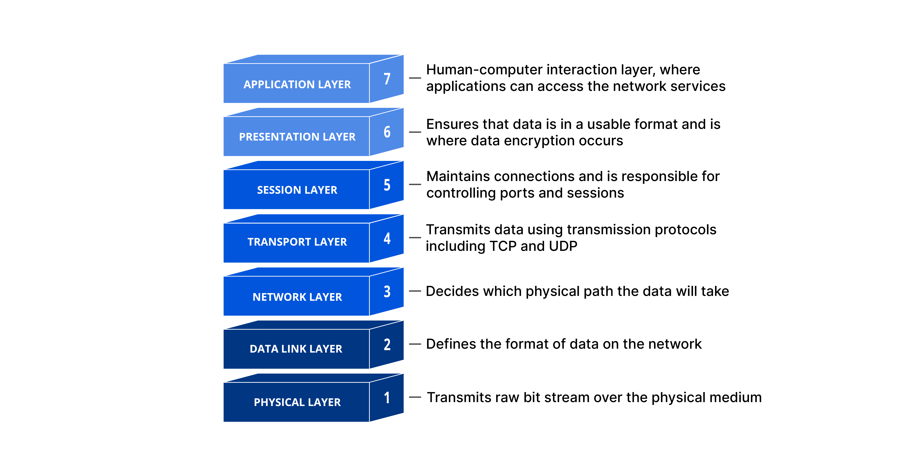

# UDP FPGA

Implementing raw ethernet frame parsing in hardware to communicate using a point-to-point ethernet link connection using the UDP data protocol.

https://github.com/daniel-sudz/udp-fpga/assets/52898838/3c39b399-b354-42f4-a91c-baba29a6c7b9

# Networking Overview

   
 

The OSI networking model provides a conceptual understanding of how applications can communicate across networked protocols. For our project the correspondance is as follows: 

* Layer 1 corresponds to the PHY or the Ethernet Physical Layer. The PHY is onboard the FPGA and is reponsible for converting the analog data across CAT5/CAT6 cables into a digital signal that can be further processed.
* Layer 2 corresponds to the layer 2 ethernet frame as described below.
* Layer 3 correspods to the IPV4 protocol as described below.
* Layer 4 correponds to the UDP protocol as described below.

### Ethernet Header Frame

| **MAC Destination** | **MAC Source** | **Ethertype** | **Payload** | **Frame Check Sequences** |
| ------------------------- | -------------------- | ------------------- | ----------------- | ------------------------------- |
| 6 bytes                   | 6 bytes              | 2 bytes             | variable          | 4 bytes                         |

A layer two ethernet frame is laid out as follows above. The payload of the ethernet frame contains the next level of the networking stack. In our case, we set the "ethertype" type field to `0x0800` which specifies that the payload will contain an IPV4 packet.

The ethernet protocol is a global delivery mechanism. Packets are routed from a source MAC adress to a destination MAC address. Every device comes with a unique MAC adress from the factory that be universally identified.

### IPV4 Header Frame

| Octet, Bits | 0                             | 1   | 2   | 3   | 4        | 5   | 6   | 7   | 8                  | 9   | 10  | 11  | 12  | 13  | 14            | 15  | 16                 | 17  | 18  | 19             | 20  | 21  | 22  | 23  | 24  | 25  | 26  | 27  | 28  | 29  | 30  | 31  |
| ----------- | ----------------------------- | --- | --- | --- | -------- | --- | --- | --- | ------------------ | --- | --- | --- | --- | --- | ------------- | --- | ------------------ | --- | --- | -------------- | --- | --- | --- | --- | --- | --- | --- | --- | --- | --- | --- | --- |
| 0           | **VERSION**             | ... | ... | ... | **IHL** | ... | ... | ... | **DSCP**     | ... | ... | ... | ... | ... | **ECN** | ... | **LEN**      | ... | ... | ...            | ... | ... | ... | ... | ... | ... | ... | ... | ... | ... | ... | ... |
| 4           | **ID**                  | ... | ... | ... | ...      | ... | ... | ... | ...                | ... | ... | ... | ... | ... | ...           | ... | **FLAGS**    | ... | ... | **FRAG** | ... | ... | ... | ... | ... | ... | ... | ... | ... | ... | ... | ... |
| 8           | **TTL**                 | ... | ... | ... | ...      | ... | ... | ... | **PROTOCOL** | ... | ... | ... | ... | ... | ...           | ... | **CHECKSUM** | ... | ... | ...            | ... | ... | ... | ... | ... | ... | ... | ... | ... | ... | ... | ... |
| 12          | **SRC** **ADDR**  | ... | ... | ... | ...      | ... | ... | ... | ...                | ... | ... | ... | ... | ... | ...           | ... | ...                | ... | ... | ...            | ... | ... | ... | ... | ... | ... | ... | ... | ... | ... | ... | ... |
| 16          | **DEST** **ADDR** | ... | ... | ... | ...      | ... | ... | ... | ...                | ... | ... | ... | ... | ... | ...           | ... | ...                | ... | ... | ...            | ... | ... | ... | ... | ... | ... | ... | ... | ... | ... | ... | ... |
| 20          | **OPTIONS (IHL>5)**          | ... | ... | ... | ...      | ... | ... | ... | ...                | ... | ... | ... | ... | ... | ...           | ... | ...                | ... | ... | ...            | ... | ... | ... | ... | ... | ... | ... | ... | ... | ... | ... | ... |
| ...         | ...                           | ... | ... | ... | ...      | ... | ... | ... | ...                | ... | ... | ... | ... | ... | ...           | ... | ...                | ... | ... | ...            | ... | ... | ... | ... | ... | ... | ... | ... | ... | ... | ... | ... |
| 56          | ...                           | ... | ... | ... | ...      | ... | ... | ... | ...                | ... | ... | ... | ... | ... | ...           | ... | ...                | ... | ... | ...            | ... | ... | ... | ... | ... | ... | ... | ... | ... | ... | ... | ... |

The IPV4 protocol extends the global delivery mechanism of point-to-point ethernet by enabling delivery of packets to specific IP addresses. Depending on the IP range, a given IP address may be either local or global to a given network. As a result, IP ranges provide a level of hierarchy that allows the delivery of packets to scale effectively to a large number of inter-connected networks.

### UDP Header Frame

| Source Port | Destination Port | Length  | Checksum | Data     |
| ----------- | ---------------- | ------- | -------- | -------- |
| 2 bytes     | 2 bytes          | 2 bytes | 2 bytes  | variable |

The UDP protocol is the simplest method of sending and recieving raw data packets within an IPV4 frame. The protocol is "one-shot" in that it proves no redudency for packets that have failed to deliver. The UDP protocol is commonly used in streaming application where only the latest packet is of importance to the user. The UDP protocol provides segmentation of data streams with the source and destination port fields enabling up to 65536 unique concurrent data streams between any two given IP addresses. 

# Networking Link Layer Linux Resources

- [ ] Calculate IP Checksum: https://gist.github.com/david-hoze/0c7021434796997a4ca42d7731a7073a
- [ ] Send Raw Ethernet Packet in Linux: https://gist.github.com/austinmarton/1922600
- [ ] Recieve Raw Ethernet Packet in Linux: https://gist.github.com/austinmarton/2862515
